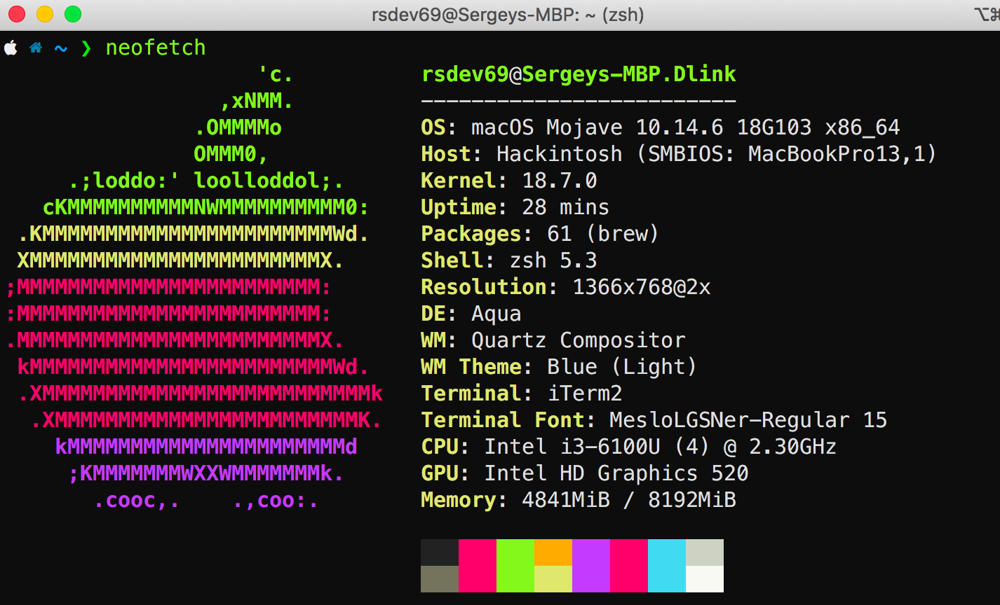
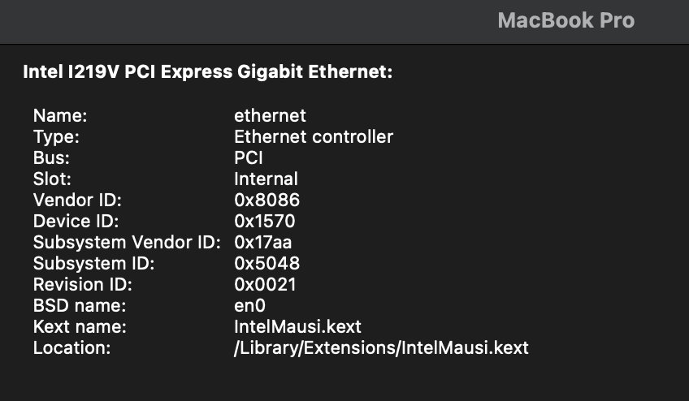
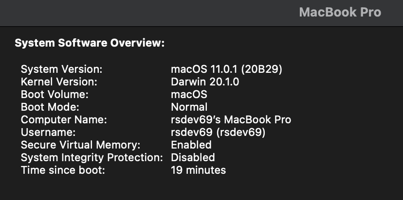
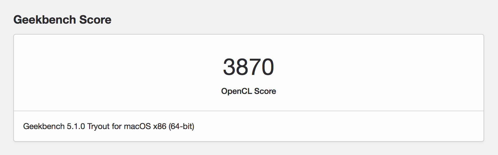
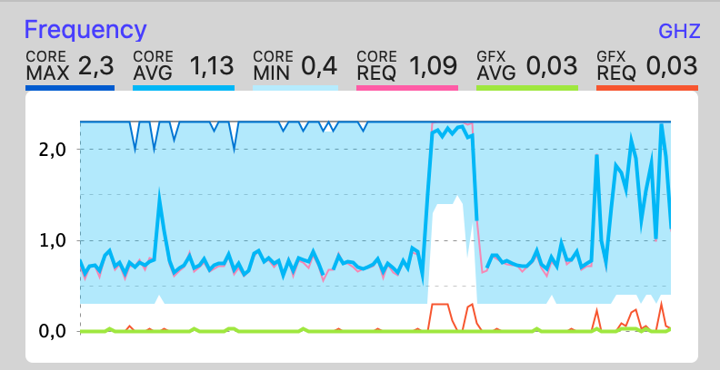
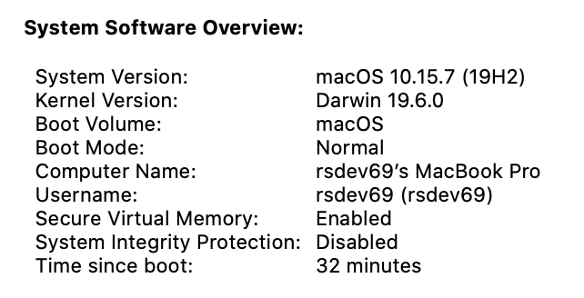
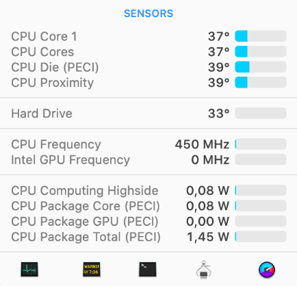
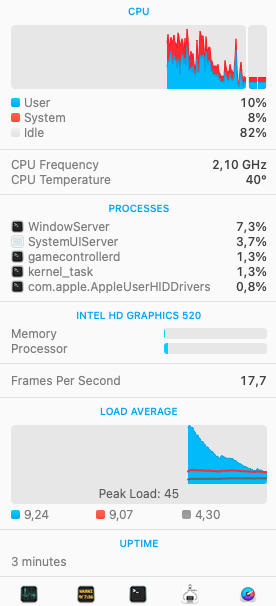
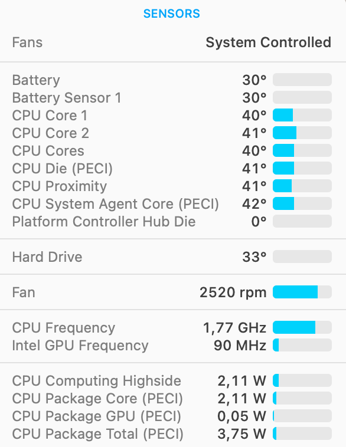
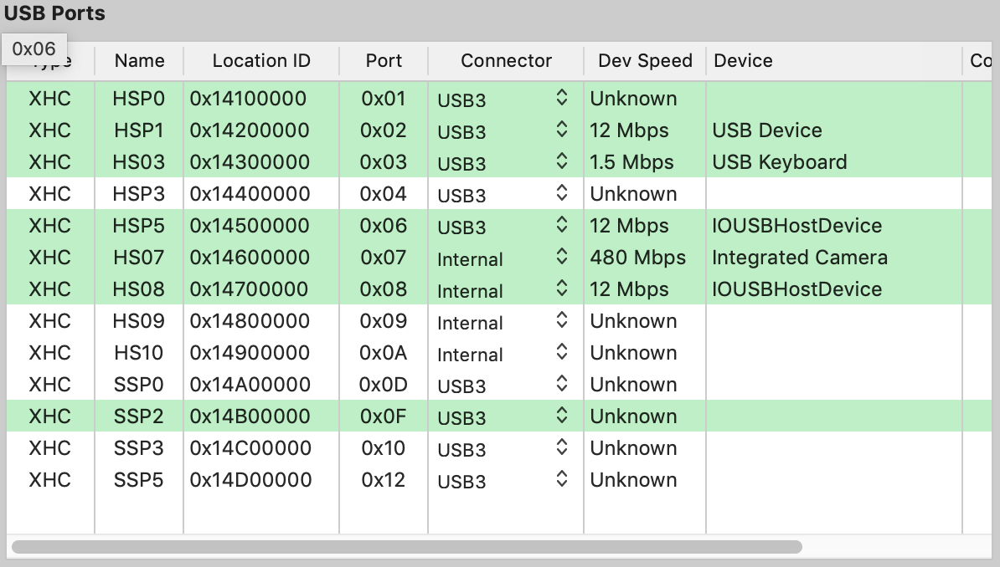

# Lenovo-E560-Clover

This repo contains the files and scripts to install macOS on the Lenovo E560 family
Refer to this Guide for the details:

<https://www.tonymacx86.com/threads/stable-lenovo-e560-full-work.248842/>

<table>
<tr>
  <th>DESCRIPTION</th>
  <th>LENOVO™ THINKPAD® E560</th>
  <th>Work</th>
</tr>
<tr>
  <td>Processor</td>
  <td>Intel® Core™ i3 6100U Processor</td>
  <td>YES</td>
</tr>
<tr>
  <td>Graphics</td>
  <td>Intel HD Graphics 520</td>
  <td>YES</td>
</tr>
<tr>
  <td>Memory</td>
  <td>8192 MB DDR3L-1600, 2 slots</td>
  <td>YES</td>
</tr>
<tr>
  <td>Display</td>
  <td>15.6 inch 16:9, 1920 x 1080 pixel, LP156WF6-SPK2</td>
  <td>YES</td>
</tr>
<tr>
  <td>Storage</td>
  <td>Goodram SSD 256GB</td>
  <td>YES</td>
</tr>
<tr>
  <td>Wifi</td>
  <td>Tp-link 725n</td>
  <td>YES</td>
</tr>
<tr>
  <td>Bluetooth</td>
  <td>Intel 3165</td>
  <td>YES</td>
</tr>
<tr>
  <td>Speakers</td>
  <td>Conexant HD Audio CX20753/4</td>
  <td>YES</td>
</tr>
<tr>
  <td>USB Ports</td>
  <td>3 x USB 3.0</td>
  <td>YES</td>
</tr>
<tr>
  <td>VGA Port</td>
  <td>Max Full HD 60hz</td>
  <td>YES</td>
</tr>
<tr>
  <td>HDMI 1.4 Ports</td>
  <td>Max 4k 30hz</td>
  <td>YES</td>
</tr>
</table>

