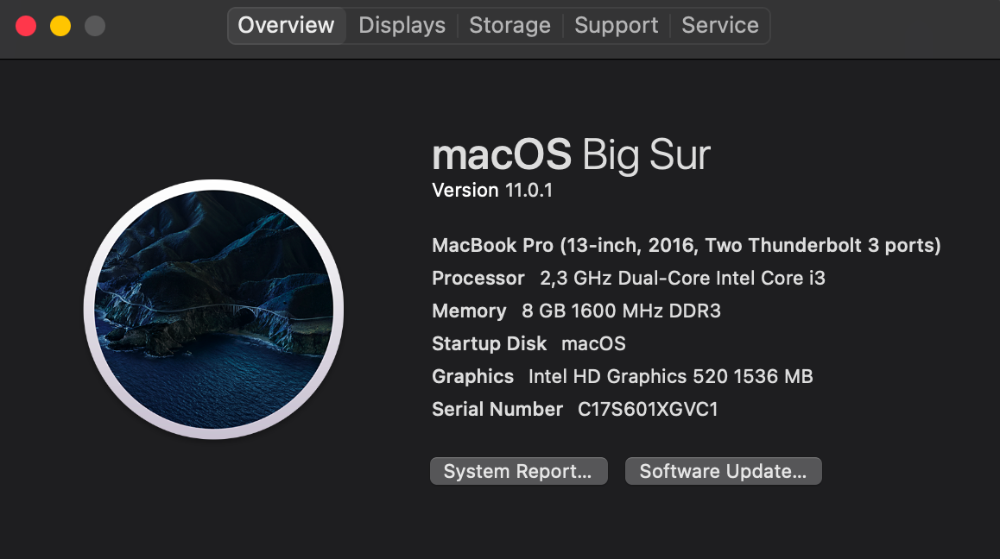
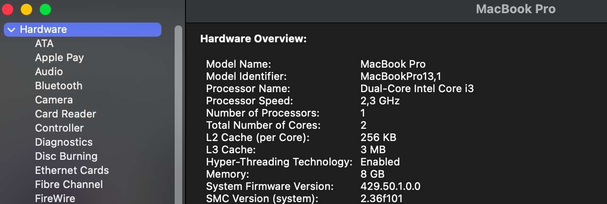
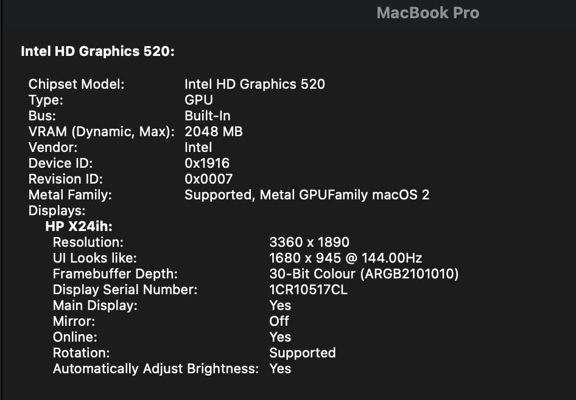

# Lenovo Thinkpad E560 OpenCore 0.7.9

This repo contains the files and scripts to install macOS on the Lenovo E560 family.
 
## Hardware 💻

| Type           | Spec                                | Status|
|----------------|-------------------------------------|-------|
| Computer       | Lenovo ThinkPad E560                |   ✅  |
| BIOS Version   | LENOVO v1.40                        |   ✅  |
| CPU            | Intel i3 6100U 2300 MHz             |   ✅  |
| Display        | 15.6 inch 16:9, 1920 x 1080 pixel   |   ✅  |
| Ethernet       | Intel I219V Gigabit Ethernet        |   ✅  |
| Memory         | 8192 MB DDR3L-1600 MHz / PC3L-12800 |   ✅  |
| Graphics       | Intel HD Graphics 520               |   ✅  |
| Audio          | Conexant HD Audio CX20753/4         |   ✅  |
| Touchpad       | Elan Touchpad                       |   ✅  |
| USB Ports      | 3 x USB 3.0                         |   ✅  |
| Storage        | Goodram SSD 256GB                   |   ✅  |
| Wifi            | IntelAC 3165                       |   ✅  |
| VGA Port       | Max Full HD 60hz                    |   ✅  |
| Card Reader    | 10/15 MB/s                          |   ✅  |
| HDMI 1.4 Ports | Max 4k 30hz                         |   ✅  |

## Bios settings 💾

| Menu     |                   |                                 | Setting     |
|----------|-------------------|---------------------------------|-------------|
| Config   | USB               | UEFI BIOS Support               | `Enable `   |
|          | Power             | Intel SpeedStep Technology      | `Enable `   |
|          |                   | CPU Power Management            | `Enable `   |
|          | CPU               | Hyper-Threading Technology      | `Enable `   |
| Security | Security Chip     |                                 | `Disable `  |
|          | Memory Protection | Execution Prevention            | `Enable `   |
|          | Virtualization    | Intel Virtualization Technology | `Enable `   |
|          |                   | Intel VT-d Feature              | `Enable `   |
|          | Anti-Theft        | Computrace                      | `Disable `  |
|          | Secure Boot       |                                 | `Disable `  |
|          | Intel SGX         |                                 | `Disable `  |
|          | Device Guard      |                                 | `Disable `  |
| Startup  | UEFI/Legacy Boot  |                                 | `UEFI Only` |
|          | CSM Support       |                                 | `No`        |
|          | Boot Mode         |                                 | `Quick`     |

## General knowledge & credits

- [xzhih](https://github.com/xzhih)'s [one-key-hidpi](https://github.com/xzhih/one-key-hidpi) to improve quality of system UI
- [simprecicchiani](https://github.com/simprecicchiani) [ThinkPad-T460s-macOS-OpenCore](https://github.com/simprecicchiani/ThinkPad-T460s-macOS-OpenCore) to make ACPI files

## What's not working ⚠️

- [ ] Fingerprint Reader
## ScreenShots
 
  

  

## A reward❤️

All the project is made for free!!!
