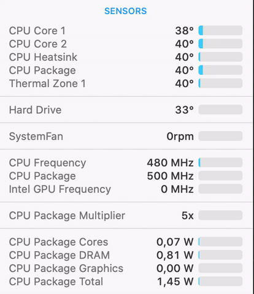

# Lenovo Thinkpad E560 (Clover, OpenCore bootloader)

[](https://developer.apple.com/documentation/macos-release-notes)
[](https://github.com/acidanthera/OpenCorePkg)
[](/LICENSE)

This repo contains the files and scripts to install macOS on the Lenovo E560 family. 

## Hardware Status

Type | Spec | Status 
---------|---------|:----------
Computer		| Lenovo ThinkPad E560   | Working | 
BIOS Version	| LENOVO v1.40 | Working | |
CPU				| Intel i3 6100U 2300 MHz | Working | 
Display		    | 15.6 inch 16:9, 1920 x 1080 pixel | Working |
Ethernet		| Intel I219V Gigabit Ethernet | Working |
Memory		    | 8192 MB DDR3L-1600 MHz / PC3L-12800 | Working | 
Graphics		| Intel HD Graphics 520 | Working | 
Audio			| Conexant HD Audio CX20753/4 | Working |
Touchpad		| Elan Touchpad | Working | 
USB Ports		| 3 x USB 3.0 | Working | 
Storage		    | Goodram SSD 256GB | Working | 
Wifi		    | IntelAC 3165 | Working | 
VGA Port		| Max Full HD 60hz | Working | 
HDMI 1.4 Ports	| Max 4k 30hz | Working | 

## Bios settings

* `Config` > `USB` > `UEFI BIOS Support` > **Enable**
* `Config` > `Power` > `Intel SpeedStep Technology` > **Enable**
* `Config` > `Power` > `CPU Power Management` > **Enable**
* `Config` > `CPU` > `Hyper-Threading Technology` > **Enable**
* `Security` > `Security Chip` > **Disable**
* `Security` > `Memory Protection`>`Execution Prevention`>**Enable**
* `Security` > `Virtualization` > `Intel Virtualization Technology` > **Enable**
* `Security` > `Virtualization` > `Intel VT-d Feature` > **Enable**
* `Security` > `Anti-Theft` > `Computrace` > `Current Setting` > **Disable**
* `Security` > `Secure Boot` > **Disable**
* `Security` > `Intel SGX` > **Disable**
* `Security` > `Device Guard` > **Disable**
* `Startup` > `UEFI/Legacy Boot` > **UEFI Only**
* `Startup` > `CSM Support` > **No**
* `Startup` > `Boot Mode` > **Quick**

## General knowledge & credits

* [Why OpenCore](https://dortania.github.io/OpenCore-Install-Guide/why-oc.html)

* [Dortania's guide to install macOS](https://dortania.github.io/OpenCore-Install-Guide/)

* [SSDT patches from OC-little](https://translate.google.it/translate?sl=zh-CN&tl=en&u=https%3A%2F%2Fgithub.com%2Fdaliansky%2FOC-little)

* Useful tools by [@CorpNewt](https://github.com/corpnewt)

* [Acidanthera's OpenCore and kexts development](https://github.com/acidanthera)

* [@MSzturc](https://github.com/MSzturc) for keyboard map and [ThinkpadAssistant](https://github.com/MSzturc/ThinkpadAssistant)

* [xzhih](https://github.com/xzhih)'s [one-key-hidpi](https://github.com/xzhih/one-key-hidpi) to improve quality of system UI

## True Macbook experience 

#### [Generate your own SMBIOS](https://github.com/corpnewt/GenSMBIOS)

1. Launch Terminal.app
1. Copy the following script, paste it into the Terminal window, then press ENTER
   ```bash
   git clone https://github.com/corpnewt/GenSMBIOS && cd GenSMBIOS && ./GenSMBIOS.command 
   ```
1. Type `2`, then press ENTER
1. Drag your `config.plist` inside the Terminal window
1. Type `3`, then press ENTER
1. Type `MacbookPro13,1`, then press ENTER

## What's not working ⚠️

- [ ] Fingerprint Reader

- [ ] Card Reader

macOS  |macOS
:-------------------------:|:-------------------------:
  |  
  |  
  |  
  |  
  |  
  |  
  |  

