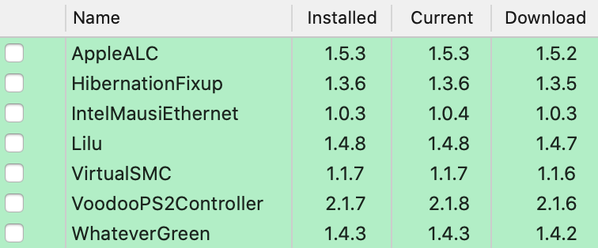

# Lenovo-E560-Clover

This repo contains the files and scripts to install macOS on the Lenovo E560 family. Stable.

## Hardware Status

Type | Spec | Status | Link
---------|---------|:----------:|----------
Computer		| Lenovo ThinkPad E560   | Working | -
BIOS Version	| LENOVO v1.39 | Working | -
CPU				| DualCore Intel® Core™ i3 6100U Processor, 2300 MHz | Working | -
Display		    | 15.6 inch 16:9, 1920 x 1080 pixel, LP156WF6-SPK2 | Working | -
Ethernet		| Intel I219V PCI Express Gigabit Ethernet: | Working | -
Memory		    | 8192 MB DDR3L-1600 MHz / PC3L-12800, 2 slots | Working | -
Chipset			| Intel Sunrise Point-LP, Intel Skylake-U | Working | -
Graphics		| Intel HD Graphics 520 | Working | [Guide](https://www.tonymacx86.com/threads/guide-intel-framebuffer-patching-using-whatevergreen.256490/)
Audio			| Conexant HD Audio CX20753/4 | Working | [Guide](https://github.com/acidanthera/AppleALC/wiki/Installation-and-usage)
WiFi			| Intel Dual Band Wireless-AC 3165 - M.2 Card | Not Working | -
Bluetooth		| Intel(R) Wireless Bluetooth(R) | Working | -
Touchpad		| ELAN | Working | -
Keyboard		| Keyboard |Working | -
USB Ports		| 3 x USB 3.0 | Working | -
Storage		    | Goodram SSD 256GB | Working | -
Wifi		    | Tp-link 725n | Working | -
VGA Port		| Max Full HD 60hz | Working | -
HDMI 1.4 Ports	| Max 4k 30hz | Working | -

macOS Mojave 10.15.4            |  macOS Catalina 10.14.6
:-------------------------:|:-------------------------:
  |  
  |  
  |  
  |  
  |  
  |  
  |  

